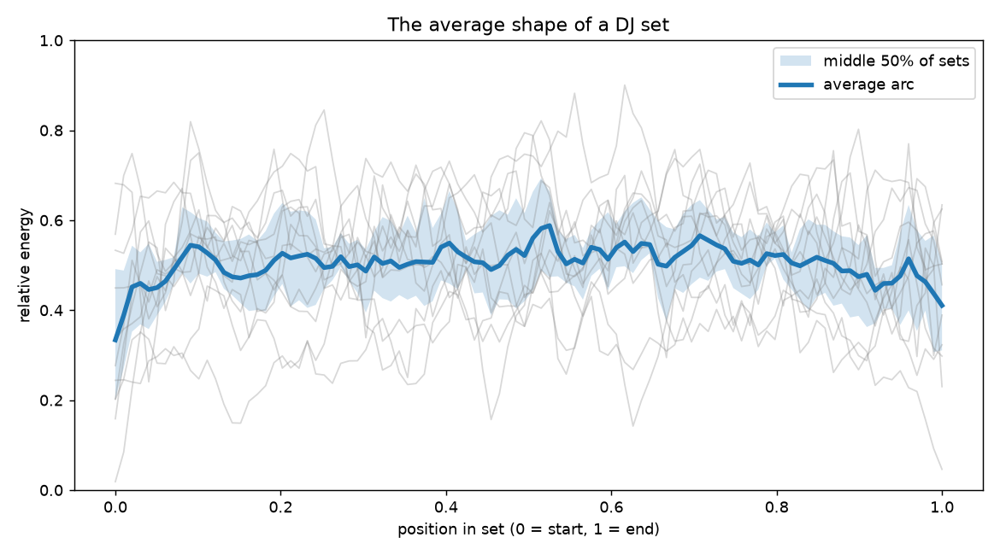
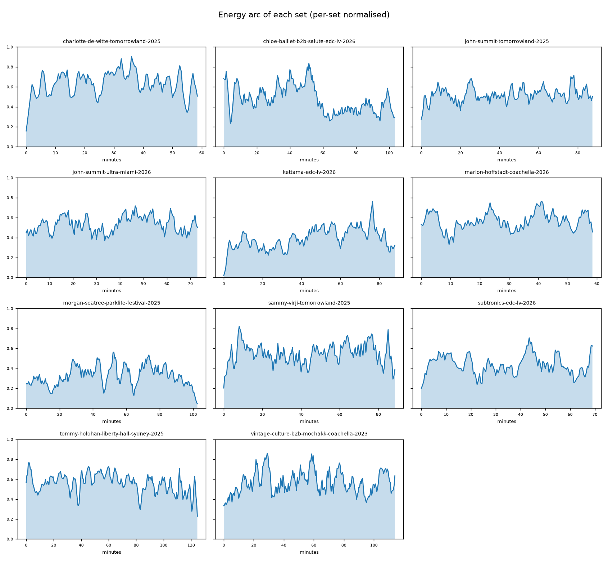
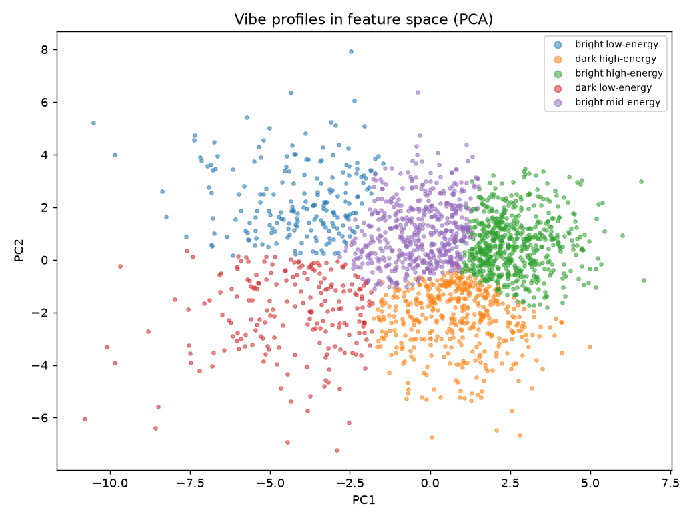
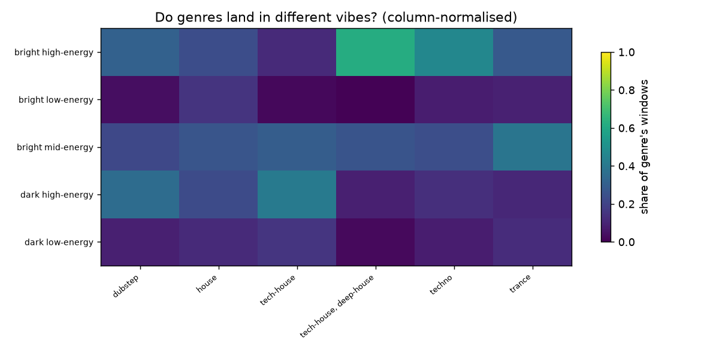
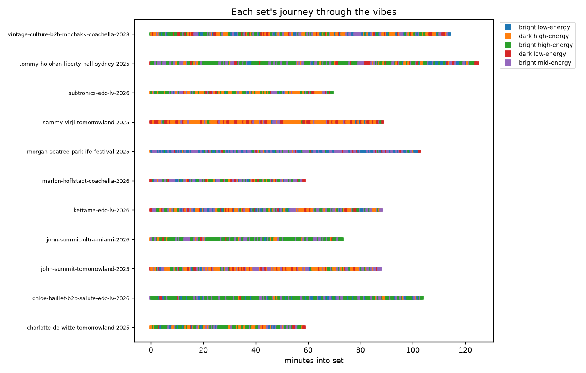
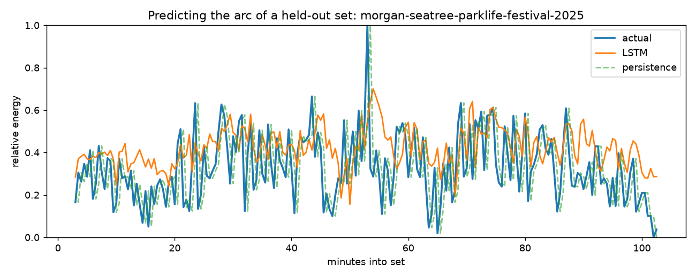
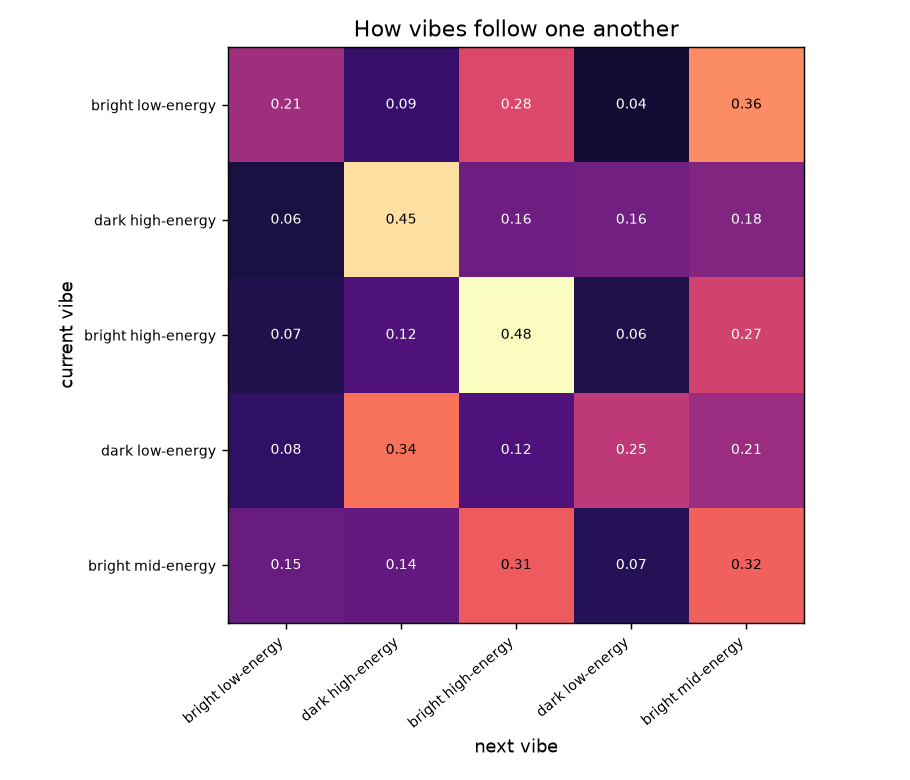

# DJ Set Energy Arc Modeller

In my opinion, what makes a DJ set good is how it carries energy, with smooth transitions that keep the crowd moving. This sense of momentum building and easing across a set is what I think of as its energy arc, and this project sets out to measure it directly from the audio, and then teach a model to anticipate where a set is going next.

## Why I built this

I love music, dance music in particular, thus I wanted my next project to be
about something I genuinely enjoy rather than another generic dataset. On top of
that, audio is something almost no student data science portfolio goes near, so
it felt like a chance to stand out while learning more about digital
signal processing, which I had never properly touched before.

The whole pipeline runs straight off the audio using `librosa`. Spotify used to expose features like energy, tempo and key through its
API, but it closed that to new apps in late 2024. As it happens, all of those
qualities can be measured from the waveform itself. Working them out from scratch is exactly what I do here.

## How it works

I take a handful of public DJ sets and turn each one into a story about its
energy over time.

| Step | What I do | Module |
|------|-----------|--------|
| **Acquire** | Download public sets I list in `configs/sets.csv` | `src/acquire.py` |
| **Extract** | Cut each set into 30-second windows and pull features from each one: BPM, energy, brightness, key, and a danceability proxy | `src/extract_features.py` |
| **Build the arc** | Join the windows into one energy time series per set | `src/build_arc.py` |
| **Model the arc** | Train an LSTM to predict the next window's energy from the last few, so it learns how sets rise and fall | `src/train_lstm.py` |
| **Cluster vibes** | Group windows into "vibe profiles" (e.g. dark techno vs melodic house) from the features alone | `src/cluster_vibes.py` |
| **Recommend** | Given the last few windows and a target energy, suggest what kind of vibe should come next | `src/recommend.py` |
| **App** | Wrap it all in a Streamlit app | `src/app.py` |

## Results

All of the below is produced end-to-end by the scripts in `src/`, run on 11
public sets (1,946 thirty-second windows) using only `librosa` audio features.
The full write-up is in [docs/writeup.md](docs/writeup.md).

### 1. A set has a distinct shape



Lining every set up on a common timeline and averaging them, a clear shape
appears: open low, climb fast across the first tenth, hold high through the middle
with a gentle peak just past halfway, then ease off at the end. The sets coincide
most at the start (the band is narrowest there) and differ most in the middle.

### 2. Every set still keeps its own personality



There is a shared feature, but plenty of individual style on top: some sets build
to a late climax, some front-load and sustain, some oscillate throughout.

### 3. Sets are built from a handful of vibes



Clustering windows by their sound alone (no genre labels) gives five clean vibe
profiles: bright/dark and low/mid/high-energy. 
As the heatmap below shows, different genres clearly prefer different vibes, with techno
leaning bright high-energy and tech-house leaning dark high-energy.


*Each column is a genre and the brighter the cell, the more of that genre's windows fall into that vibe. Since the model never saw these labels, the clear pattern is good evidence the vibes are not arbitrary.*



Tagging every window turns each set into a journey through these vibes, and these
journeys are not random.

### 4. The arc is predictable



An LSTM predicts the next window's energy from the previous six. Validated on two whole unseen sets and compared against a persistence baseline, it reaches
**RMSE 0.203 vs the baseline's 0.239, about a 15% improvement**.
The picture shows why: the raw energy (blue)
is jumpy at thirty-second resolution, the persistence guess (dashed) just echoes
the previous value and always lags, while the LSTM (orange) ignores the noise and
tracks the underlying trend.

### 5. Planning the next move



Combining the transition matrix (vibes are sticky, with diagonals around 0.45 to
0.48) with energy-target matching gives a recommender: given the recent windows
and a target energy, it suggests the next vibe/song to play. Ask it to lift and it
pushes towards high-energy vibes; ask it to cool down and it picks low-energy
ones, always prioritising transitions real DJs actually make.

## A note on the music

I only point `configs/sets.csv` at sets that are already public, and the audio
never leaves my machine or goes into the repo. The only things I commit are the
small feature tables and figures I make from them, not anyone's actual music.

## Layout

```
configs/      config.yaml (all the settings) + sets.csv (the list of sets)
src/          one file per pipeline stage
data/raw/     downloaded audio (gitignored, re-downloadable)
data/interim/ the per-window feature tables
figures/      charts for this README
outputs/      models, cluster labels, app bits
```

## Setup

```bash
python3 -m venv .venv && source .venv/bin/activate
pip install -r requirements.txt
brew install ffmpeg            # yt-dlp and librosa need it to read audio

# 1. List the sets I want in configs/sets.csv (id, artist, event, url)
# 2. Download them:
python -m src.acquire
```
