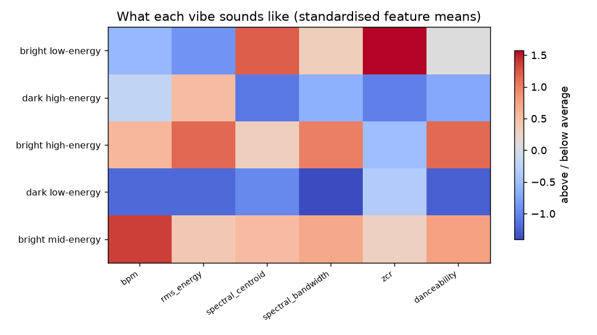
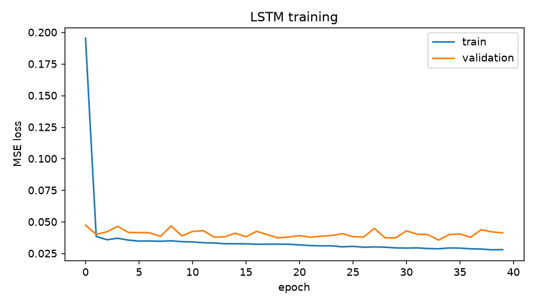

# What the data says about the anatomy of a DJ set

This project was my attempt to actually measure the energy levels of a set, and what makes a set good.
I took eleven public sets, turned each one into numbers
using just the audio, and asked a few questions: is there a typical shape
to a set, can a model learn it, and what is a set actually made of?

Everything below comes from the scripts in `src/`. No streaming API
was involved, since I measure features directly from
the waveform with `librosa`.

## The data

I downloaded eleven full festival and club sets (Charlotte de Witte, John Summit,
Subtronics, Kettama and others), spanning techno, tech-house, trance, house and
dubstep. Each set is cut into 30-second windows, and every window is described by
26 features: tempo, loudness/energy, spectral brightness, a danceability proxy,
the estimated key, and twelve MFCC timbre coefficients. This gives me 1,946 windows
in total. The energy of each set is normalised to its own
range so that a quietly mastered set and a loud one are compared on shape rather
than volume.

## Finding 1: a set has a distinct shape

When I line every set up on a common timeline (0 at the start, 1 at the end) and
average them, a clear shape appears.

A set starts low, climbs quickly across roughly the first tenth, holds high through
the middle with a gentle peak just past the halfway mark, and eases off at the
very end. What I found most telling is *where the sets agree*. The shaded band,
which covers the middle half of the sets, is at its narrowest right at the
opening. In other words, DJs largely differ in the middle of a set but almost all
of them start out the same way. This pattern is consistent enough to see through eleven very
different artists.

## Finding 2: every set keeps its own personality

The average is only half the story. Plotting each set on its own shows how
differently they get from start to finish.

Some sets build steadily towards a late climax, some front-load the energy and
sustain it, and some oscillate the whole way through. This is exactly what I would
hope to see: there is a common ground (Finding 1) but plenty of room for
individual style on top of it.

## Finding 3: sets are built from a handful of vibes

Energy tells me how hard a set is hitting, but not *what kind* of sound is filling
that energy. To get at that, I clustered every window by its character (tempo,
brightness, timbre, danceability) without giving the model any genre labels. Five
natural groups emerge, and they separate cleanly in feature space.

Reading each cluster's average features back gives them plain-language names:
bright low-energy, dark low-energy, bright mid-energy, dark high-energy and bright
high-energy. The heatmap below shows what each one actually sounds like.

The clusters are not arbitrary. When I check them against the genre tags I kept
aside (the model never saw these), different genres clearly prefer different
vibes: techno leans into the bright high-energy vibe, tech-house into dark
high-energy, and trance into bright mid-energy.

## Finding 4: DJs move between vibes in habitual ways

Once every window has a vibe, a set becomes a journey through them, and those
journeys are not random.

You can see Sammy Virji sit in a long dark high-energy passage through the middle,
while Tommy Holohan's techno set is full of bright high-energy blocks. Counting up
how often one vibe follows another turns this into a transition matrix.

The strong diagonal is the interesting part. Bright high-energy
follows itself 48% of the time and dark high-energy 45% of the time. DJs settle
into a vibe and ride it before switching, rather than hopping around every thirty
seconds. The off-diagonal entries are the realistic moves between vibes, and they
are what my recommender leans on later.

## Finding 5: the arc is predictable

If a set really has a rule, a model should be able to anticipate it. I trained
an LSTM to predict the energy of the next window from the previous six, and I
judged it the strict way: it is validated on two unseen sets during
training, and it is compared against a persistence baseline that simply guesses
"the next energy equals the current energy". For a smooth signal that baseline is
surprisingly hard to beat, so beating it is the real test.

On the held-out sets, the LSTM reaches an RMSE of 0.203 against the baseline's
0.239, an improvement of about 15%. The picture shows why: the raw energy (blue)
is jumpy at thirty-second resolution, the persistence guess (dashed) just echoes
the previous value and always lags, while the LSTM (orange) ignores the noise and
tracks the underlying trend.

## Putting it together: planning the next move

The last piece combines the two models into something a DJ could actually use.
Given the recent windows of a set and a target energy, the recommender suggests
what song/vibe to play next. It blends two things: how usually one vibe follows the
current one (from the transition matrix) and
how close a candidate vibe's typical energy is to the target (so it actually
steers where you want to go). The LSTM rides along to report the natural next
energy implied by the recent windows, such that I can tell whether my target is asking
the set to push harder or to ease off relative to its own momentum.

In practice, the recommender behaves sensibly. Sitting in a bright high-energy passage and
asking to lift towards a peak, it recommends staying in high-energy territory.
Asking instead to cool things down, it switches to the low-energy vibes, while
still prioritising transitions that real DJs actually make.

## Limitations

Eleven sets is a small sample, so the average arc is indicative rather than definitive, and the vibe clusters would
firm up with more data. "Energy" here is a loudness-based measure, which is a fair
proxy but not the whole of how a crowd experiences intensity. 

## The anatomy of a set

Pulling it together, the data says a DJ set is not a random playlist. It has a
distinct shape (warm up fast, hold high, come down at the end), it is built from a
small set of recurring vibes that line up with genre, those vibes 
move between each other in habitual ways, and the whole trajectory is predictable
enough that a model beats a strong baseline at guessing where it goes next.
